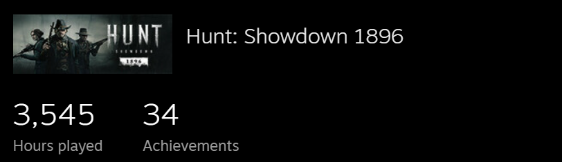
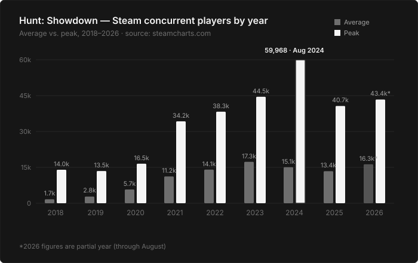

import VideoEmbed from '../../components/VideoEmbed.astro';

During Marathon's gameplay reveal, Twitch chat filled up with "Oh great,
another extraction shooter," "extraction ResidentSleeper shooter
ResidentSleeper," and "i was excited until i heard the words extraction
shooter."

They weren't wrong to be exhausted by the genre. Tarkov spent years
turning it into something that couldn't be enjoyed casually, and one
studio ended up setting the tone for an entire category. But that
reputation was Tarkov's, not the genre's, and it isn't what sank
Marathon either. Marathon has great gunplay and fun classes. What sank
it was chasing the wrong parts of the formula, quests, loot, and shield
levels bolted onto a shooter that already worked, and the rest of this
is about the formula it should have chased instead.

The quests, the loot, the shield levels, all of it was the wrong kind of
loot chase for Bungie's fanbase. Destiny players grind for guns that make
a build function or perform better in a fight, and it's theirs for good.
Marathon's grind farms materials, not weapons or armor, to unlock a
faction tier that only lets you buy something better, and you're paying
for it again on every single run.

## The formula that already works

Marathon would have done better if it had followed Hunt: Showdown's
formula, though I'll admit that's not an unbiased opinion. I've put over
3,500 hours into Hunt with no plans on stopping any time soon.

It's not just me, either. Hunt: Showdown launched into Early Access in
February 2018 and hit 1.0 in August 2019. Eight years later it isn't
coasting on nostalgia, it's still growing: average concurrent players
climbed from roughly 1,650 in 2018 to over 17,000 by 2023, while yearly
peak concurrent players grew from about 14,000 to 44,500 over that same
stretch, before the game set its all-time high of 59,968 concurrent in
August 2024. Extraction shooters aren't supposed to age like that. Good
gunplay, good maps, sound design that actually matters, and cosmetics
people want to buy apparently do it anyway.

Bias aside, that formula would have let Bungie stay with what it's best at,
which is gunplay and level design. No armory. No factions. No agents. No
contracts. No upgrades. No backpacks. No loose (non-combat) loot littered
around the maps. No inventory management.

Shields would work the same way. Everyone queues in with the same shield
quality, whatever is currently the blue tier, and there's no way to grind
or buy your way above it. Right now a fight can be tilted before anyone
aims: green versus purple, blue versus gold, the higher tier soaking
enough extra damage that the better player has to fight uphill just to
win the trade.
Flatten that ceiling and the fight goes back to positioning and aim, not
whoever farmed the longer session.

It's not just Hunt either. The Division's Dark Zone did something similar
back in 2016, dropping extraction-style stakes into a game built for a
mostly-PvE, mostly-casual crowd, and it became the mode the whole game got
remembered for. The formula travels. Marathon just needed to let it.

## How it plays

I'm borrowing Hunt's structure and none of its vocabulary.

Pick your loadout at the menu and queue up. The map is random. Once you're
in, you need to find the terminals, one in each compound, and use them. Every
terminal reveals a piece of the map. Use three and the whole thing opens up,
boss included. No quest marker walks you there, you search the compounds
yourself, and every second spent looking is a second another squad might
find you first.

<VideoEmbed src="/videos/marathon/terminals.mp4" poster="/videos/marathon/terminals.jpg" caption="Finding the boss — investigating terminals" />

Kill the boss, start the uplink, and obtain the Payload.

<VideoEmbed src="/videos/marathon/boss-fight.mp4" poster="/videos/marathon/boss-fight.jpg" caption="The boss fight" />

Then you run the uplink. While it runs, every other team in the lobby can
see exactly where it's happening. When it finishes, you pick up a single
Payload.

<VideoEmbed src="/videos/marathon/uplink.mp4" poster="/videos/marathon/uplink.jpg" caption="Running the uplink" />

Carrying the Payload also gives you five seconds of Overlay to spot nearby
enemies. It's not a countdown that starts the moment you grab it, it's a
charge you hold and burn on your own terms, the same way Darksight works
in Hunt. Most people save Overlay for the compound they're about to walk
into, or the second they hear footsteps that don't belong to their
squad.

<VideoEmbed caption="video showing what Overlay (Darksight) looks like" />

From the moment you grab the Payload, though, everyone in the server can
see where you are, and everyone is trying to kill you and take what
you're carrying. That's the entire stakes system in one mechanic, no
quest to clear first and no gear check to win, just a position on the
map that says come and take it.

<VideoEmbed src="/videos/marathon/payload.mp4" poster="/videos/marathon/payload.jpg" caption="Carrying the Payload — visible on the map" />

The job now is to extract with the Payload. If you make it, you get paid, and
the money buys your next loadout directly, no faction tier to unlock first,
no second grind standing between the payout and the gear.

The PvE enemies work as audio traps. If you start shooting
the AI, or they start shooting you, every squad in earshot knows where you
are. Some of them will decide to come find you before you get anywhere near
the boss. It does the job loose loot usually does in these games, giving
you a reason to move through a space, without asking you to stop and
inventory-manage a pile of junk on the floor.

## Start to finish

The whole loop, menu to extraction:

1. Choose your loadout and squad size, solo, duo, or trio.
2. Load into a match with other squads, all hunting the same boss.
3. Find terminals, one per compound. Three reveals the boss's location.
4. Reach the boss and kill it.
5. Run the uplink, then grab the Payload.
6. Pick an extraction route and survive the run, with your position visible to the entire server the moment you're carrying it.

Bungie needed to trust its own gunplay enough to stop dressing it up as
something else. Halo and Destiny
already proved the studio can build incredible gunplay and amazing maps
people talk about for a decade. The game just needed to point in that
direction instead of chasing a genre Tarkov already owns the reputation
for.

Marathon didn't fail because extraction shooters are tired. It failed
because it never bothered to look at the one that isn't.
