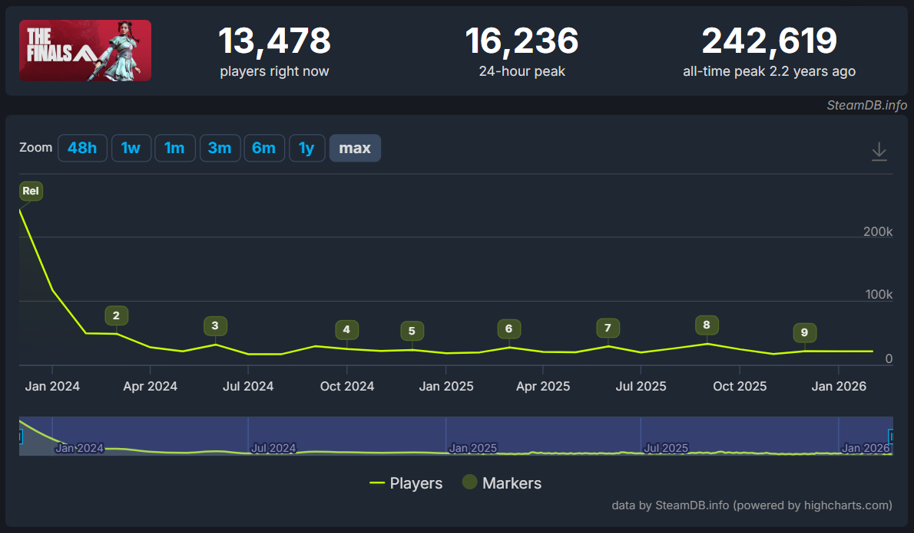
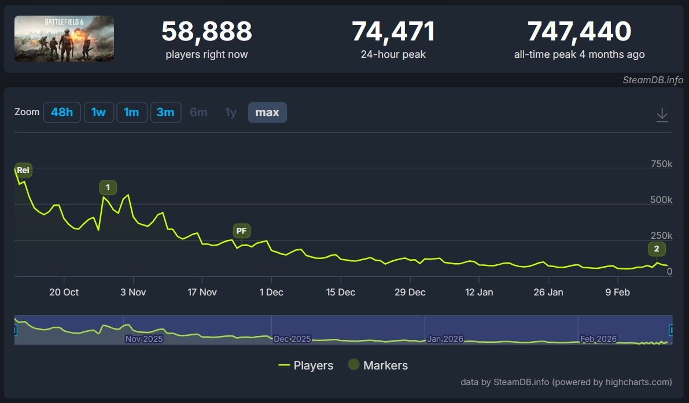
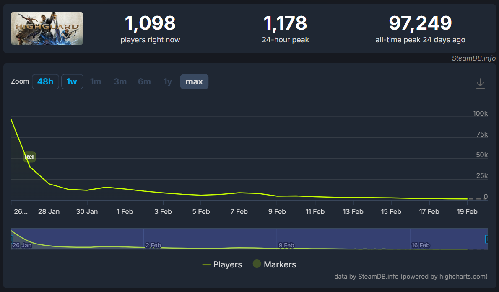
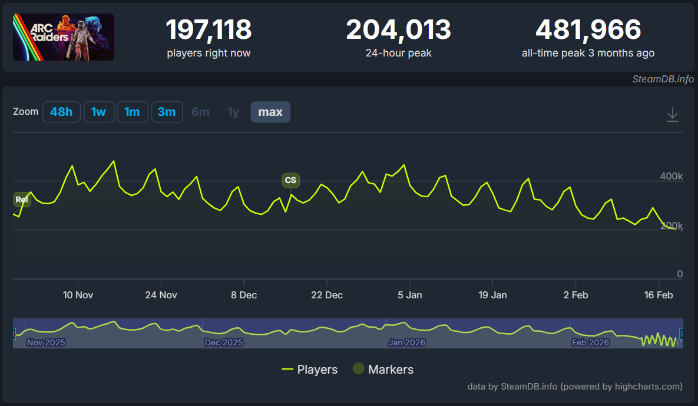
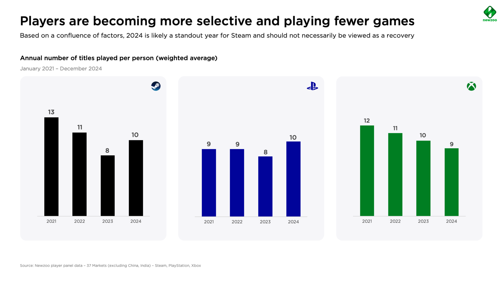

On launch night it feels like a city.

You log in and the servers are full. Matchmaking is instant. Streams are everywhere. For a week or two it feels like this is where everyone lives.

Then the line bends.

Look at the player charts and the shape repeats. A massive peak in week one. By month two, the average concurrent count often drops by half or more. Sometimes far more. The launch is loud. The drop is almost silent.

A shrinking player count does not automatically mean the mechanics are weak or the ideas are flawed.

What interests me more is how quickly players pull back when something feels unfamiliar. Even when the systems are solid. Even when the core loop works. The moment a game asks for a different rhythm, a different mental model, a different kind of attention, many people drift back to what they already know.

Most established games come with muscle memory. Controls feel automatic. Systems are understood. Social circles are already there. You don’t have to think about how to engage. You just log in.

A new game asks for cognitive effort. New maps. New pacing. New metas. New expectations around skill. Even if those systems are well designed, they require translation.

In a saturated market where time is limited, the lowest effort option often wins.

## The numbers tell a more complicated story.

The Finals is a clean example of a curiosity spike settling into a smaller but durable core group of players.

In December 2023, it hit an all time SteamCharts peak of 242,399 concurrent players, with a monthly average of 120,211. By January 2024 the monthly average was 60,179, and by February 2024 it was 24,848. As of February 19, 2026, the last 30 days average is about 12,063.

From peak to the current average, that is roughly a 95% decline in concurrent players on Steam, even though the game continues to run and has a mostly positive long term review profile on Steam.

More recently, Battlefield 6 shows a similar retention cliff.

On SteamCharts Battlefield 6 posted an all time peak of 656,067 concurrent players. Its monthly average in October 2025 was 311,140. In November it averaged 223,407. In December it averaged 89,597. In January 2026 it averaged 56,525, and the last 30 days average as of February 19, 2026 is about 43,976. From October’s monthly average to December’s monthly average, the SteamCharts average dropped by about 71% within two months.

Highguard is the most extreme case of a modern multiplayer launch that fails to convert attention into trust.

The Steam store lists a release date of January 26, 2026 and shows mixed user reviews, with 46% of reviews marked positive at the time of capture. SteamDB lists an all time peak of 97,249 concurrent Steam players on January 26, 2026 and shows 826 players in game on February 19, 2026. That is about a 99% drop in concurrent players within weeks.

Three different arcs. One familiar curve.

A useful contrast is ARC Raiders, because it shows that a huge launch does not require a huge collapse.

SteamCharts lists an all time peak of 465,097, with a last 30 days average of 194,587 as of February 19, 2026. That is still a large post launch floor months later. Its Steam store page shows very positive user reviews, with 86% positive overall.

They live in different genres and attract different kinds of players. The comparison still holds. When we talk about new ideas it helps to see that breaking the mold does not automatically lead to failure.

## The first constraint is not mechanics. It is time.

Most players are not looking for a new home.

[Newzoo data](https://newzoo.com/resources/blog/into-the-data-pc-console-gaming-report-2025) reported that from January to December 2024, 67% of PC player hours were spent in games that were six or more years old, while only 8% of time went to games less than two years old. That is a habit problem, not an awareness problem. Many players are not shopping for a new home every month. They are already living somewhere.

Habits are already formed. A launch does not compete with other launches. It competes with routines.

## The second constraint is population itself.

Matchmaking quality influences churn. Consecutive losses, large skill gaps, and network instability push players out. As player counts fall, match quality degrades. The experience worsens. The curve steepens.

## The third constraint is trust, and it is decided early.

Many negative reviews appear within the first several hours of play. Once sentiment slips into Mixed territory, conversion drops. Fewer new players replace the ones who leave. By month two, the narrative is already hardening.

## You could argue the fourth constraint is money.

In 2026 everything continues to increase in price. Gamers are becoming more selective with their game purchases and where to spend their time.

There is also a tension beneath the data. There is a line between fresh and unfamiliar. Ideas that bend the formula invite curiosity. Ideas that break it create distance. Sequels sell on recognition first. Reinvention has to earn its way in.

## First Person Shooter franchises run on expectation.

This is the pace. This is the rhythm. This is what a match feels like. When that shifts too far, too fast, the ground feels unstable.

Battlefield 6 attempted to recover its identity after 2042. It restored the class system and signaled a return to form. But post launch changes to pacing, modes, and cross mode incentives made the direction feel less stable than the promise. Even when the core fantasy is right, volatility erodes the confidence they initially built.

---

The Finals did not have to find itself. It showed up knowing what it was. Tight gunplay. Real destruction. A game show layer that felt intentional instead of gimmicky. It was clear about the kind of shooter it wanted to be.

The challenge was never identity. It was traction. Seasons rolled out. Balance shifted. New content shipped. The game kept moving. But the broader audience never quite moved with it.

It’s hard to deny how good it feels to play The Finals. Yet it never became the default choice. Being one of the best is different from being the one people build their week around.

## The spike is attention. The floor is habit.

A modern launch is not successful because it peaks high. What matters is whether it finds a stable floor.

The games that last are not always the most innovative. They are the ones that feel clear about what they are, fair in how they behave, and steady in where they are going.

Underneath all of that is trust. Review scores affect acquisition. Acquisition replaces churn. Once sentiment slips, recovery becomes expensive.

A successful game in 2026 does not just launch well. It earns confidence quickly, communicates clearly, and behaves consistently.
